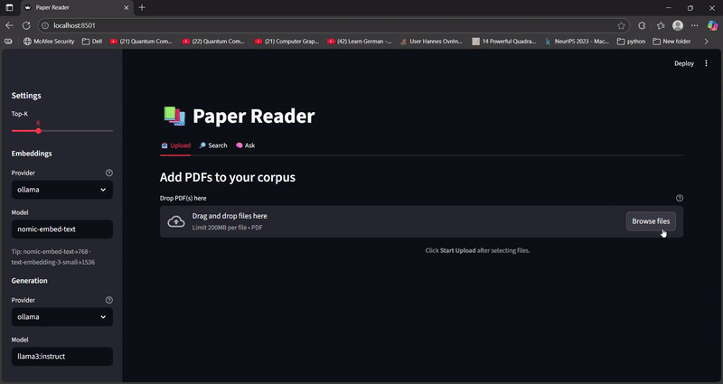

# 🧠 Paper Reader – Your Local NotebookLM


An open-source, local-first alternative to **Google’s NotebookLM** – built with 🐳 Docker, 🧠 Ollama, 🔍 FastAPI, and 🔡 Streamlit.

Upload PDFs, search with hybrid retrieval, and ask grounded questions — all **fully local**, with full control and extensibility.

---

## ✨ Features

✅ Upload any PDF or academic paper  
✅ Automatic chunking and embedding  
✅ Ask questions grounded in your docs  
✅ Get answers with sources and context  
✅ Hybrid search: BM25 + kNN vectors  
✅ Works with local LLMs (Ollama) or OpenAI  
✅ Streamlit UI with Upload + Search + Ask tabs  
✅ Fully dockerized for local use  
✅ Async job queue – no waiting on uploads

---

## 📸 Demo

> Upload → Chunk → Embed → Ask 🔥

<p align="center">
  
</p>

---

## 🧠 How It Works

This is a full-stack, document-grounded AI system:

1. **Upload** PDFs or documents
2. **Parse + chunk** using `PyMuPDF`
3. **Embed** with `nomic-embed-text` (Ollama) or OpenAI
4. **Index** chunks in OpenSearch (BM25 + kNN)
5. **Query** via hybrid search
6. **Generate answers** with LLM + source snippets
7. **Streamlit UI** for exploration

---

## 🛠️ Tech Stack

| Layer | Stack |
|--|--|
| 📦 Backend | FastAPI, PostgreSQL, OpenSearch |
| 🧠 Embeddings | Ollama (nomic-embed-text) or OpenAI |
| 🧠 LLM Answering | Ollama (llama3:instruct) or OpenAI |
| 🎛️ Frontend | Streamlit (tab-based: Upload, Search, Ask) |
| 🧩 Chunking | PyMuPDF |
| 🔍 Retrieval | BM25 + vector similarity (k-NN) |
| 🐳 Infra | Docker, Docker Compose |
| 🧵 Async Queue | Python background thread (production-lite) |

---

## ⚙️ Getting Started

```bash
# Clone this repo
git clone https://github.com/anuj-aj/Paper-Reader
cd Paper-Reader

# Pull models (if using Ollama)
ollama pull nomic-embed-text
ollama pull llama3:instruct

# Run the app
docker compose up --build
